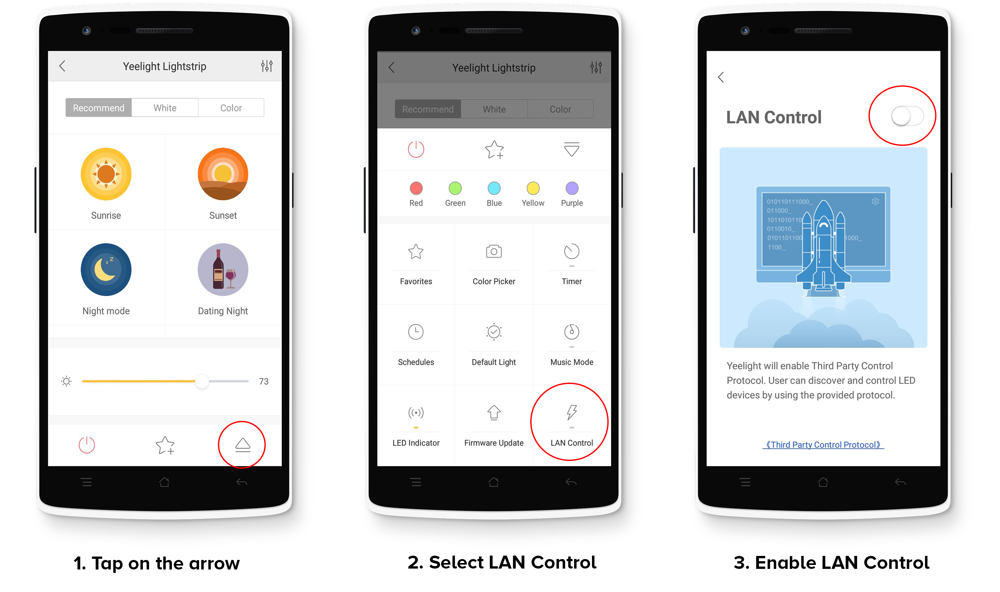

# MagicMirror² : Yeelight Bulb Control
A MagicMirror² Module for controlling the Yeelight Bulb

## Enabling the LAN Control option
To enable the LAN control and make your lights discoverable by this module you need to:

1. Turn on your light.
2. Open the ``Yeelight`` app on your phone.
3. Navigate to device, tap on the arrow to open a option menu
4. Now select the LAN Control option
5. Finally, enable the LAN Control by tapping on the switch. It will become green once the LAN control is enabled.





## Installation
1. Navigate into your MagicMirror's `modules` folder
2. Execute `git clone https://github.com/putera/MMM-Yeelight.git`
3. Run `npm install`

## Using the module
To use this module, add it to the modules array in the `config/config.js` file:

You may use `MMM-AssistantMk2` from https://github.com/eouia/MMM-AssistantMk2 to trigger the command

```javascript
modules: [
    {
        module: 'MMM-Yeelight',
        config: {
            // See 'Configuration options' for more information.
            // remove the lights parameter if you want to control all the lights on the network
            lights: [
            	{ name: 'My Kitchen Light 1', ip: '192.168.1.10'},
            	{ name: 'Living Room 1', ip: '192.168.1.11'},
            	...
            ]
        }
    }
]
```

## Configuration Options
The following properties can be configured:

| **Option** | **Description** |
| --- | --- |
| `lights` | (*Optional*) List of all your Yeelight bulb |
